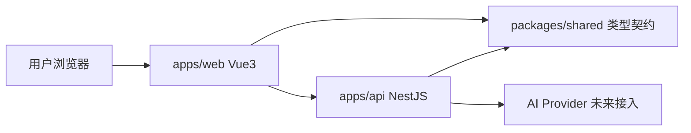

# Dreamer

Dreamer 是一个基于 Monorepo 的 AI 创作应用原型，当前聚焦在「无限画布 + AI 对话 + 生成能力接入边界」。

   

## 导航

- [项目亮点](#项目亮点)
- [目标能力mvp](#目标能力mvp)
- [技术栈](#技术栈)
- [仓库结构](#仓库结构)
- [快速开始](#快速开始)
- [本地访问地址默认](#本地访问地址默认)
- [架构关系](#架构关系)
- [环境变量约定](#环境变量约定)
- [api 调用示例](#api-调用示例)
- [faq--排错](#faq--排错)

## 项目亮点

- **规格先行**：基于 `OpenSpec` 管理需求、设计与任务，降低实现偏差。
- **前后端解耦**：通过 `packages/shared` 维护共享契约，稳定接口边界。
- **并行开发**：依托 `pnpm workspace + turbo`，提升多应用协作效率。
- **可扩展画布**：当前以 `image/text` 为核心，为后续节点能力扩展打基础。

## 目标能力（MVP）

- 无限画布编辑体验（Pixi.js）
- AI 对话输入与内容编排（Tiptap）
- AI 生图接口边界（先占位，后续接入真实模型 provider）
- 当前节点类型：`image`、`text`

## 技术栈

- 包管理与工作区：`pnpm workspace`
- 任务编排：`turbo`
- 前端：`Vue 3 + Vite + TypeScript + UnoCSS`
- 后端：`NestJS + TypeScript`
- 共享包：`packages/shared`
- 规格驱动：`OpenSpec`

## 仓库结构

```text
.
├── apps/
│   ├── web/          # 前端应用（画布与 AI 交互）
│   └── api/          # 后端服务（健康检查与 AI 边界）
├── packages/
│   └── shared/       # 前后端共享类型/契约
├── openspec/         # 需求、设计、任务与变更归档
├── package.json      # 根脚本（turbo 编排）
└── turbo.json
```

## 环境要求

- Node.js 18+（推荐使用 LTS）
- pnpm 10+

## 快速开始

在仓库根目录执行：

```bash
pnpm install
pnpm dev
```

默认会通过 Turbo 并行拉起工作区中的开发任务。

## 常用命令

```bash
# 同时启动前后端
pnpm dev

# 仅启动前端
pnpm dev:web

# 仅启动后端（watch）
pnpm dev:api

# 全仓构建
pnpm build

# 全仓类型检查
pnpm typecheck

# 全仓 lint
pnpm lint
```

## 本地访问地址（默认）

- Web：`http://localhost:5173`
- API：`http://localhost:3000`

> 如果端口被占用，请以终端实际输出为准。

## 架构关系



## 环境变量约定

当前仓库未强制要求 `.env`，建议按以下方式预留：

```bash
# apps/web/.env.local
VITE_API_BASE_URL=http://localhost:3000

# apps/api/.env
PORT=3000
# AI_PROVIDER_API_KEY=xxx
```

当后续接入真实 provider 时，建议在 `apps/api` 统一管理密钥，不在前端暴露敏感信息。

## 演示与截图

- Web 主页截图建议放置在：`docs/assets/home.png`
- 画布编辑截图建议放置在：`docs/assets/canvas.png`
- AI 对话交互录屏建议放置在：`docs/assets/chat.gif`

你可以在这里插入图片：

```md


```

## 按应用执行命令

```bash
# 仅在 web 应用内执行构建
pnpm --filter web build

# 仅在 api 应用内执行测试
pnpm --filter api test

# 仅在 api 应用内执行 lint
pnpm --filter api lint
```

## API 基线

- 健康检查：`GET /health`
- AI 生成占位：`POST /ai/generate`

当前 `/ai/generate` 为能力边界占位，返回 `not_implemented`，用于先稳定前后端契约。

## API 调用示例

```bash
# 健康检查
curl -X GET http://localhost:3000/health

# AI 生成占位接口
curl -X POST http://localhost:3000/ai/generate \
  -H "Content-Type: application/json" \
  -d '{"prompt":"a cute cat in watercolor style"}'
```

> 返回结构会随着 provider 接入演进，建议以前后端共享类型定义为准。

## 开发约定

- 优先在 `packages/shared` 定义跨端类型，避免前后端重复声明。
- 需求和变更通过 `openspec` 管理，保证实现与规格一致。
- 新增功能建议拆为「规格 -> 任务 -> 实现」三步推进，便于协作与回溯。

## 推荐开发流程

```bash
# 1) 安装依赖
pnpm install

# 2) 本地开发
pnpm dev

# 3) 提交前检查
pnpm typecheck
pnpm lint
pnpm build
```

## Roadmap（简版）

- [ ] 接入真实 AI 图像生成 provider
- [ ] 增加更多画布节点类型（如 shape、group、connector）
- [ ] 完善节点序列化/反序列化与协作能力
- [ ] 为 API 边界补充集成测试与错误码规范

## 里程碑（建议）

- `v0.1.x`：完成单机 MVP（画布基础能力 + AI 占位接口）
- `v0.2.x`：接入首个可用 AI provider，打通端到端生图流程
- `v0.3.x`：扩展节点体系与持久化能力

## FAQ / 排错

**1) `pnpm dev` 没有同时启动 web 和 api？**

- 检查根目录是否执行过 `pnpm install`。
- 确认你在仓库根目录执行命令，而不是在子目录中执行。

**2) 端口冲突导致启动失败？**

- Vite/Nest 会提示占用端口，可直接按提示切换端口或结束占用进程。

**3) 类型检查失败但应用可运行？**

- 运行 `pnpm typecheck` 查看全仓错误。
- 优先修复 `packages/shared` 中的类型漂移问题，再处理应用层错误。

## 版本发布（建议）

- 建议采用 `changeset` 或语义化版本策略统一管理 workspace 版本。
- 当前处于 MVP 阶段，可先按里程碑手动打 tag（如 `v0.1.0`、`v0.2.0`）。

## 贡献

欢迎通过 Issue / PR 参与共建。提交前请确保：

- 在本地通过 `pnpm typecheck`、`pnpm lint`、`pnpm build`
- 变更涉及行为调整时，同步更新 `openspec` 相关规格

## License

本项目采用 [MIT License](./LICENSE)。
